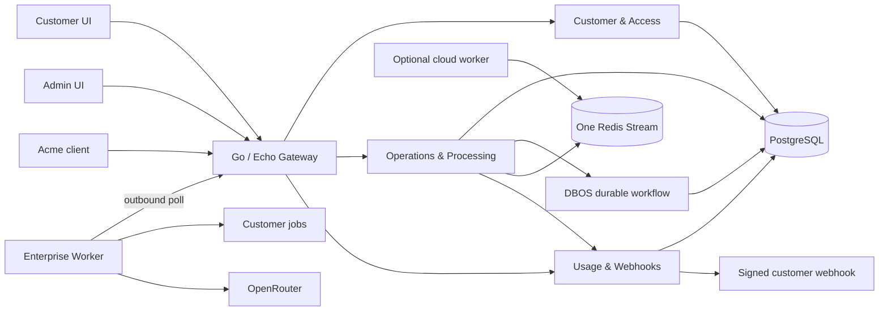

# Architecture

## Trust boundary

The control plane never opens an inbound connection to an enterprise network. A private worker authenticates with a tenant API key, polls through the public gateway, leases one operation, invokes a locally reachable target, and reports the outcome. Connection strings and customer service credentials stay in the customer environment. Job payloads currently transit the control plane; envelope encryption or payload-reference-only mode is the next hardening step for regulated data.

## Service responsibilities

| Process | Responsibility |
|---|---|
| Gateway | Authentication delegation, tenant context, distributed rate limiting, request IDs, routing |
| Customer & Access | Users, tenants, roles, JWT issuance, hashed API keys |
| Operations & Processing | State machine, idempotency, DBOS recovery, Redis dispatch, leases, retry, cancellation, DLQ/redrive |
| Usage & Webhooks | Atomic append-only ledger, quotas, durable webhook outbox, HMAC signing, SSE updates |
| Enterprise Worker | Outbound polling, local execution, heartbeat, OpenRouter fallback |
| Cloud Worker | Optional explicit cloud execution profile |

## Failure handling

- API submission is deduplicated by `(tenant_id, idempotency_key)`.
- DBOS starts each first submission with workflow ID `operation:<uuid>` and checkpoints Redis publication.
- Workers must acquire a database lease before executing. Heartbeats extend that lease.
- Retryable network, timeout, HTTP 429, and HTTP 5xx failures receive bounded exponential backoff.
- Exhausted or permanent failures become `DEAD_LETTERED`; operators can redrive them.
- `SUCCEEDED`, `DEAD_LETTERED`, and `CANCELLED` are terminal and cannot be overwritten.
- Usage entries have unique event keys; worker retries cannot double charge.
- Webhooks use a PostgreSQL outbox, exponential retry, and `FOR UPDATE SKIP LOCKED` dispatch.

## Data model

One PostgreSQL database is separated into `access`, `operations`, and `usage` schemas. DBOS owns its own system tables. Every business row is tenant-scoped; the gateway derives tenant identity from verified credentials, never from a request body.

## Scaling

Gateway and stateless services scale horizontally. PostgreSQL guards operation claims and idempotency. Redis rate limits are shared by every gateway replica. Enterprise workers scale by tenant; operation leases prevent duplicate completion even when execution is delivered at least once.
